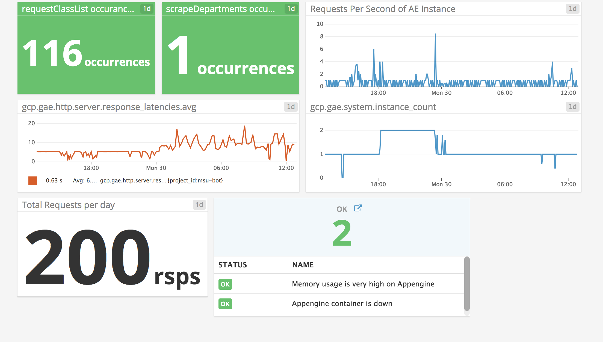
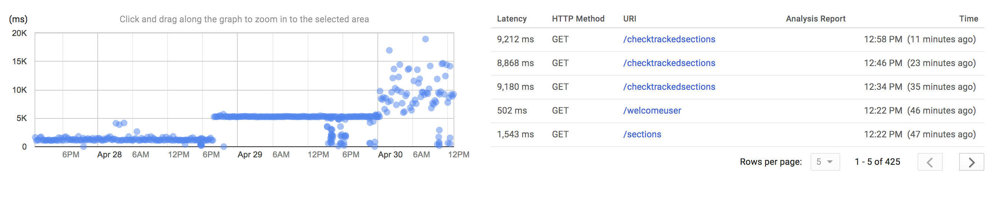
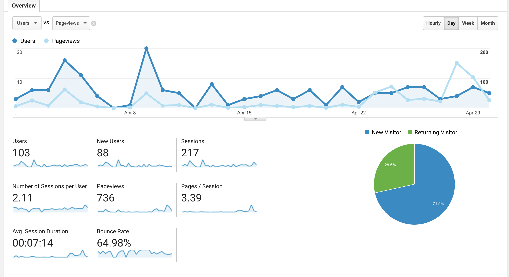

# Monitoring
For MSUBot, I opted for a few different monitoring strategies.

### Datadog
Datadog provides realtime monitoring and analytics for MSUBot, which can help us catch an issue right away.
THis screenshot shows the dashboard during Google AppEngine's service disruption, where latencies were extremely high:

### Trace
Google's Trace provides a timeline of function execution for each runtime of the function. This allows for easy comparisons of
performance, as well as where bottlenecks are located in backend code:

### Analytics
Google Analytics is attached to the frontend, to provide detailed usage metrics about our users and their experiences:

